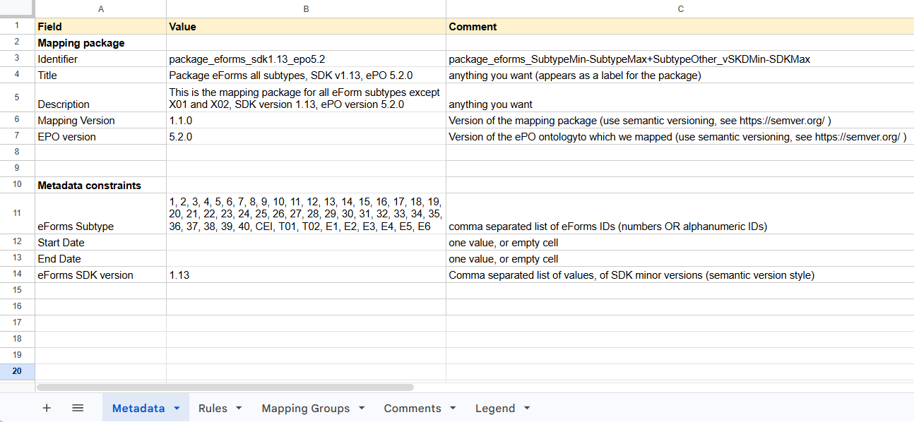

= Mapping Package Structure

== Terminological changes
Unlike in previous versions of this project, the terms "Mapping Suite" and "Mapping Package" are not the same. Please consult the xref:glossary.adoc[glossary] for further clarifications.


== Mapping Suite

The structure of an eForms Mapping Suite is similar to the structure of the Standard Forms (SF) repository, which is documented https://docs.ted.europa.eu/ODS/latest/mapping/repository-structure.html[here].

Since the Mapping Packages in this Mapping Suite can be used by the TEDSWS pipeline, in order to further decouple the two projects the following additions to the Mapping Suite were made:

* The `config` folder containing the `mapping_suite_config.json` file
* The `/src/normalisation` folder containg various files used during the notice normalisation step of the pipeline.
* The `/src/resource-queries` folder that is used to generate the queries for updating mapping resources, such as the vocabulary files.


== Mapping Package

The structure of a eForms mapping package is similar to the structure of the Standard Forms (SF) mapping package, which is documented https://docs.ted.europa.eu/ODS/latest/mapping/mapping-suite-structure.html[here].

The most relevant, but small, difference is related to the representation of the metadata, both in the Excel spreadsheet that encodes the Conceptual Mapping (CM) (`conceptual_mappings.xlsx`), as in the generated `metadata.json` file.

There is also a new lightweight package variant available for download from the repository, described in the section below.

== Lightweight Package

Lightweight packages provide a simplified, scalable format for distributing RML mapping files, focusing only on essential components required by the RML engine. This will improve clarity, interoperability, and ease of collaboration between stakeholders.

A lightweight package is a variant and a subset of a full mapping package,  excluding the CM Excel file, `output`, `test_data` and `validation` folders. It is limited to a single eForms SDK version per package, just like the complete package does. It is compatible with the new unified metadata model described further below.

The following is an example directory structure of a   lightweight package:

```
./package_eforms_sdk1.n_epox.y
├── metadata.json{ld}
|   [context.jsonld]
└── transformation
    ├── mappings
    │   └── *.rml.ttl
    └── resources
        ├── *.json
        ├── *.csv
        ...
```

== Metadata

As mentioned in xref:ChangeAndResourceManagement.adoc[Change and Resource Management], the metadata underwent some changes since https://github.com/OP-TED/ted-rdf-mapping-eforms/tree/1.1.0[version 1.0.0] of the Mappings Project. These changes resulted in a “unified” metadata model that is compatible with both Standard Forms  and eForms. The source of Truth for the `metadata.json` file remains the Metadata sheet of the Conceptual Mapping spreadsheet.

== The eForms Metadata sheet

The content of the "Metadata" sheet of an eForms Conceptual Mapping (which is slighly different from the https://docs.ted.europa.eu/ODS/latest/mapping/mapping_how.html#_the_metadata_sheet[Metadata sheet]
of a Standard Forms CM) looks like this:


The fields specified in the Metadata sheet are split into two section based on what type of information they provide. They can (a) describe the mapping package itself, and (b) the constraints necessary to identify notices eligible for transformation with this mapping package (applicable in the context of the https://github.com/OP-TED/ted-rdf-conversion-pipeline[TED-SWS pipeline]).

*Mapping package metadata:*

- *Identifier* - a unique alphanumeric sequence to identify the mapping package
- *Title* - human-readable name of the mapping package
- *Description* - human-readable concise statement about the mapping package
- *Mapping version* - the version of the mapping package
- *ePO version* - the version of the TARGET ontology

*Metadata constraints:*

- *eForms Subtype* - a comma separated list of eForm subtype IDs
- *Start date & End date* - the interval of time when an eForms notice is published. By default, they are empty
- *eForms SDK version* - a comma separated list of eForms SDK versions. Only major and minor versions of the SDK are relevant, and not the patch numbers.

The comments in column C provide explanations, where necessary, about what each field in column A stands for, and how the values in column B should be formatted. Note that, in the example above, as in most of the practical cases, there is no value specified for the "Start Date" and "End Date" fields. Those fields can be used to restrict the applicability of a given mapping package to notices published in a certain date range, which can be useful in certain scenarios (e.g. for testing), but will not be used in setups where the conversion of all the notices that belong to a certain eForms Subtype and were published according to an eForms SDK is desired.

== The eForms `metadata.json` file
After the content of a mapping package is prepared, from the "Metadata" sheet of the CM a `metadata.json` file is generated, with a content similar to this:

```JSON
{
    "@context": "context.jsonld",
    "@type": "MappingPackage",
    "id": "https://meaningfy.ws/mapping/package_eforms_sdk1.13_epo4.0",
    "title": "Package eForms all subtypes, SDK v1.13, ePO 4.0.0",
    "project_identifier": "eforms",
    "created_at": "2025-07-17T21:41:45.655425Z",
    "mapping_version": "2.0.0",
    "model_version": "5.2.0",
    "description": "This is the mapping package for all eForm subtypes except X01 and X02, SDK version 1.13, ePO version 5.2.0",
    "applicability_constraints": {
        "document_type_list": [
            "1",
            "2",
            "3",
            ...
            "E6"
        ],
        "document_schema_version_list": [
            "2.0.0"
        ]
    },
    "mapping_suite_hash_digest": "f60adfe781ba80d3202a59b6f2b7320c46fbcf8c72e231ca1b621e3055335d15"
}
```

The interpretation of the meaning of the keys used in this JSON file should be straightforward based on the explanation provided above for the <<_the_eforms_metadata_sheet,Metadata sheet of the CM>>. They are basically lower cased, snake-case versions of the field names in the Metadata sheet with the exception of the following keys becoming more generalised in order to provide a single unified metadata model that can be used for both eForms and Standard forms:

- *ePO version* becomes *model_version*
- *Metadata constraints* becomes *applicability_constraints*
- *eForms Subtype* becomes *document_type_list*
- *eForms SDK version* becomes *document_schema_version_list*

In addition, there are 3 more keys:

- *created_at* - the creation timestamp of the mapping package, more specifically of the `metadata.json` file
- *project_identifier* - the type of the mapping package. It can be either `standard_forms` or `eforms` (and it is the latter for all packages in this project)
- *mapping_suite_hash_digest* - a hash digest that can serve as a fingerprint representative of the content of this mapping package

*Note:* The `mapping_suite_hash_digest` is created by hashing the content of ALL the files in the `transformation` folder and the values of all the metadata fields. It serves as a validation fingerprint, in order to ensure the package processing software, e.g. the TED-SWS pipeline, that the metadata in this file is valid for the current content of the package. The MSSDK can assist in producing these hashes (see the https://github.com/meaningfy-ws/mapping-suite-sdk/blob/6912e51999fce515d0175e4e9c2b0c3b4cd6b551/docs/modules/ROOT/pages/cli.adoc#validation-commands[corresponding instructions]), and also with converting packages of older metadata format into the current metadata format (see https://github.com/meaningfy-ws/mapping-suite-sdk#cli-update-convert-and-validate-packages[here] for more information).
